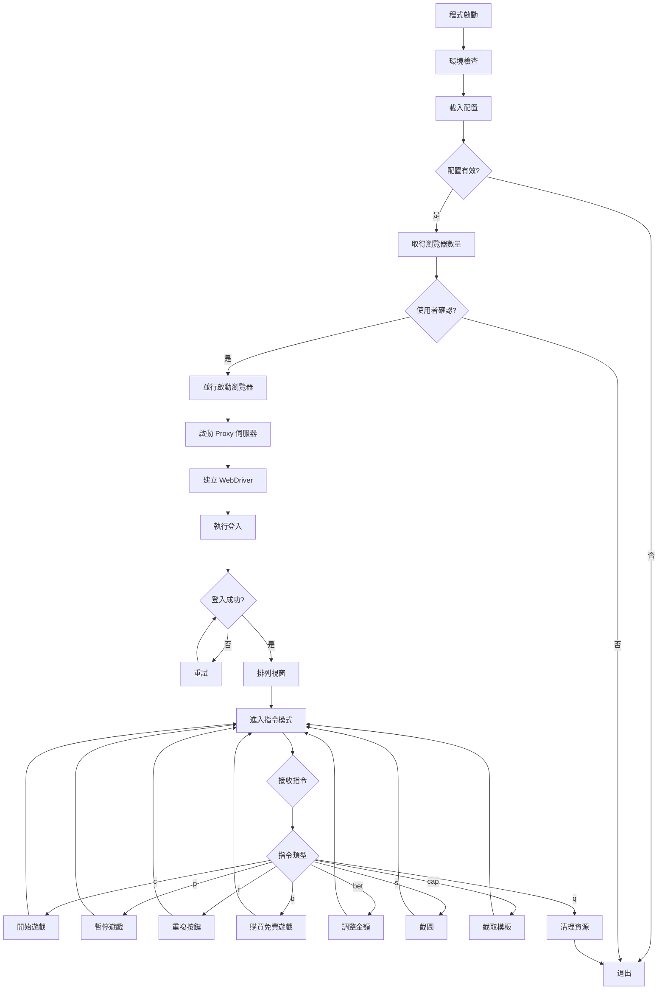

# 金富翁遊戲自動化系統 - 完整技術文件

**版本**: 2.0.0 (重構版)  
**作者**: simon980224  
**Python 版本**: 3.8+  
**專案類型**: 自動化測試 / 瀏覽器控制系統

---

## 📑 目錄

1. [系統概述](#系統概述)
2. [核心功能](#核心功能)
3. [技術架構](#技術架構)
4. [模組詳解](#模組詳解)
5. [執行流程](#執行流程)
6. [配置說明](#配置說明)
7. [API 參考](#api-參考)
8. [錯誤處理](#錯誤處理)
9. [最佳實踐](#最佳實踐)

---

## 系統概述

### 簡介

這是一個高度專業化的瀏覽器自動化系統，專為金富翁遊戲設計。系統採用現代化的 Python 架構，整合 Selenium WebDriver、圖像識別、多執行緒管理、Proxy 支援等技術，提供企業級的自動化解決方案。

### 核心特色

- **多帳號並行管理**: 支援同時控制最多 12 個瀏覽器實例
- **智慧型視窗排列**: 自動按網格模式排列視窗（4x3 配置）
- **規則驅動執行**: 基於配置檔案的遊戲策略自動執行
- **圖像識別技術**: 使用 OpenCV 進行模板匹配和遊戲狀態檢測
- **Proxy 中繼支援**: 內建本機 Proxy 伺服器，支援上游認證 Proxy
- **執行緒安全設計**: 完整的多執行緒狀態管理和同步機制
- **錯誤處理與重試**: 完善的異常處理和自動重試邏輯

---

## 核心功能

### 1. 多帳號並行登入

系統支援從配置檔案載入多組帳號密碼，並使用多執行緒並行啟動瀏覽器進行登入。每個帳號可配置獨立的 Proxy。

**實現細節**:
- 使用 `ThreadPoolExecutor` 模式的執行緒管理
- 支援 Proxy 循環使用（當 Proxy 數量少於帳號數量時）
- 自動建立本機 Proxy 中繼伺服器（端口從 9000 開始遞增）
- 每個瀏覽器間隔 1 秒啟動，避免系統過載

### 2. 智慧型瀏覽器視窗管理

**視窗排列**:
- 預設配置：4 欄 × 3 列網格
- 每個視窗尺寸：600×400 像素
- 自動計算視窗位置並設定

**視窗管理器** (`WindowManager`):
```python
WINDOW_CONFIG = WindowConfig(
    width=600,
    height=400,
    columns=4,
    rows=3
)
```

### 3. 遊戲規則自動執行

系統從 `user_rules.txt` 讀取遊戲規則，每條規則包含：
- 下注金額（betsize）
- 持續時間（分鐘）

**執行邏輯**:
1. 按順序執行規則
2. 每條規則開始前自動調整下注金額
3. 在指定時間內以隨機間隔（10-15秒）按空白鍵
4. 顯示即時進度（已按次數、剩餘時間）
5. 所有規則執行完畢後自動停止

### 4. 圖像識別與模板匹配

**技術棧**:
- **OpenCV**: 圖像處理和模板匹配
- **PIL/Pillow**: 圖像截取和裁切
- **NumPy**: 陣列運算

**應用場景**:
1. **登入流程檢測**: 
   - `lobby_login.png`: 檢測大廳登入按鈕
   - `lobby_confirm.png`: 檢測確認按鈕
2. **金額識別**:
   - 從 `img/bet_size/` 目錄載入金額模板
   - 即時比對遊戲中顯示的金額
3. **遊戲狀態檢測**:
   - 等待特定圖片出現/消失
   - 支援自訂匹配閾值（預設 0.95）

**模板匹配流程**:
```
截圖 → 灰階轉換 → 模板匹配 → 相似度計算 → 閾值判斷
```

### 5. Proxy 中繼支援

**架構**:
```
瀏覽器 → 本機 Proxy (127.0.0.1:9000+) → 上游認證 Proxy → 目標網站
```

**優勢**:
- 簡化 Chrome 的 Proxy 認證（避免彈窗）
- 統一管理 Proxy 連線
- 支援動態切換上游 Proxy

**實現**:
- `LocalProxyServerManager`: 管理多個本機 Proxy 實例
- `SimpleProxyServer`: HTTP Proxy 中繼伺服器（需單獨檔案）
- 每個瀏覽器使用獨立的本機端口

### 6. 鍵盤事件模擬

使用 Chrome DevTools Protocol (CDP) 發送原生鍵盤事件：

**支援按鍵**:
- 空白鍵（Space）: 開始遊戲
- 左方向鍵（ArrowLeft）: 減少金額
- 右方向鍵（ArrowRight）: 增加金額

**實現**:
```python
driver.execute_cdp_cmd("Input.dispatchKeyEvent", {
    "type": "keyDown",
    "key": " ",
    "code": "Space",
    "windowsVirtualKeyCode": 32,
    "nativeVirtualKeyCode": 32
})
```

### 7. 自動金額調整

**演算法**:
1. 截取當前畫面
2. 與 `bet_size/` 目錄中的金額模板逐一比對
3. 找到當前金額後，計算與目標金額的差距
4. 根據 `GAME_BETSIZE` 列表中的索引差，計算需要點擊的次數
5. 執行點擊並驗證結果
6. 微調直到達到目標金額（最多 200 次嘗試）

**支援金額**:
```python
GAME_BETSIZE = (
    0.4, 0.8, 1, 1.2, 1.6, 2, 2.4, 2.8, 3, 3.2, 3.6, 4, 5, 6, 7, 8, 9, 10,
    12, 14, 16, 18, 20, 24, 28, 32, 36, 40, 48, 56, 60, 64, 72, 80, 100,
    120, 140, 160, 180, 200, 240, 280, 300, 320, 360, 400, 420, 480, 500,
    540, 560, 600, 640, 700, 720, 800, 840, 900, 960, 980, 1000, 1080,
    1120, 1200, 1260, 1280, 1400, 1440, 1600, 1800, 2000
)
```

### 8. 指令控制系統

**可用指令**:

| 指令 | 說明 | 範例 |
|------|------|------|
| `c` | 開始遊戲（按規則自動執行） | `c` |
| `p` | 暫停遊戲 | `p` |
| `r` | 重複按空白鍵 | `r 1,2` (間隔1-2秒) |
| `b` | 購買免費遊戲 | `b` |
| `bet` | 調整下注金額 | `bet 2.4` |
| `s` | 截圖並儲存到桌面 | `s` |
| `cap` | 截取金額模板 | `cap` |
| `q` | 退出程式 | `q` |
| `h` | 顯示幫助 | `h` |

---

## 技術架構

### 系統分層

```
┌─────────────────────────────────────┐
│      使用者介面層 (CLI)              │
│  - 指令解析與執行                    │
│  - 即時日誌輸出                      │
└─────────────────────────────────────┘
           ↓
┌─────────────────────────────────────┐
│      控制層 (MainController)         │
│  - 瀏覽器生命週期管理                │
│  - 指令路由與處理                    │
└─────────────────────────────────────┘
           ↓
┌─────────────────────────────────────┐
│      業務邏輯層                      │
│  - LoginManager: 登入流程            │
│  - GameController: 遊戲控制          │
│  - GameExecutor: 規則執行            │
└─────────────────────────────────────┘
           ↓
┌─────────────────────────────────────┐
│      基礎服務層                      │
│  - BrowserManager: 瀏覽器管理        │
│  - ImageProcessor: 圖像處理          │
│  - GameStateManager: 狀態管理        │
│  - LocalProxyServerManager: Proxy   │
└─────────────────────────────────────┘
           ↓
┌─────────────────────────────────────┐
│      數據層                          │
│  - ConfigLoader: 配置載入            │
│  - PathManager: 路徑管理             │
│  - 數據模型 (UserCredential, etc.)  │
└─────────────────────────────────────┘
```

### 設計模式

1. **單例模式**: `PathManager`, `GameStateManager`
2. **工廠模式**: `BrowserManager.create_webdriver()`
3. **策略模式**: `GameExecutor.execute_with_rules()`
4. **觀察者模式**: 執行緒間狀態同步
5. **建造者模式**: `dataclass` 配置建構

### 資料流

```
user_credentials.txt → UserCredential → LoginManager → WebDriver
user_rules.txt → GameRule → GameExecutor → GameController
user_proxys.txt → LocalProxyServerManager → Chrome
```

---

## 模組詳解

### 1. 異常類別系統

**異常層次結構**:
```
GameAutomationError (基礎異常)
├── ConfigurationError (配置錯誤)
├── BrowserError (瀏覽器錯誤)
├── LoginError (登入錯誤)
├── ImageDetectionError (圖像檢測錯誤)
└── GameControlError (遊戲控制錯誤)
```

**用途**:
- 提供精確的錯誤分類
- 支援錯誤追蹤和日誌記錄
- 便於實施重試策略

### 2. 日誌系統 (`LogFormatter`)

**特色**:
- 彩色輸出（ANSI 顏色碼）
- 結構化日誌格式
- 多級別日誌支援（DEBUG, INFO, WARNING, ERROR, CRITICAL）

**顏色方案**:
```
DEBUG: 青色 (Cyan)
INFO: 綠色 (Green)
WARNING: 黃色 (Yellow)
ERROR: 紅色 (Red)
CRITICAL: 紫色 (Magenta)
```

### 3. 配置管理

**不可變配置類別** (`@dataclass(frozen=True)`):

#### `WindowConfig`
```python
WindowConfig(
    width: int = 600,
    height: int = 400,
    columns: int = 4,
    rows: int = 3
)
```

#### `GameConfig`
```python
GameConfig(
    max_accounts: int = 12,
    key_interval_min: int = 10,
    key_interval_max: int = 15,
    page_load_timeout: int = 600,
    script_timeout: int = 600,
    implicit_wait: int = 60,
    explicit_wait: int = 10,
    image_detect_timeout: int = 180,
    image_detect_interval: float = 0.5,
    image_match_threshold: float = 0.95,
    max_retries: int = 3,
    retry_delay: int = 2
)
```

#### `ElementSelector`
- 定義頁面元素的 XPath/ID
- 用於 Selenium 元素定位

#### `KeyboardKey`
- 定義鍵盤按鍵的 CDP 參數
- 包含 Space, ArrowLeft, ArrowRight

#### `ClickCoordinate`
- 定義點擊座標的相對比例
- 基於 Canvas 尺寸動態計算

### 4. 路徑管理器 (`PathManager`)

**職責**:
- 統一管理所有檔案路徑
- 支援 PyInstaller 打包後的路徑解析
- 自動建立必要目錄

**關鍵路徑**:
```python
PathManager
├── project_root: 專案根目錄
├── lib_dir: lib/ 目錄
├── img_dir: img/ 目錄
├── bet_size_dir: img/bet_size/ 目錄
├── credentials_file: user_credentials.txt
├── rules_file: user_rules.txt
└── proxys_file: user_proxys.txt
```

### 5. 數據模型

#### `UserCredential`
```python
@dataclass
class UserCredential:
    username: str
    password: str
    proxy: Optional[str] = None
    
    @property
    def proxy_config(self) -> Optional[Tuple[str, str, str, str]]:
        # 返回 (ip, port, username, password)
```

#### `GameRule`
```python
@dataclass
class GameRule:
    betsize: float
    duration_minutes: int
    
    @property
    def duration_seconds(self) -> int:
        return self.duration_minutes * 60
```

#### `GameState`
```python
@dataclass
class GameState:
    running: bool = False
    thread: Optional[threading.Thread] = None
    rules: Optional[List[GameRule]] = None
    username: Optional[str] = None
```

### 6. Proxy 管理器 (`LocalProxyServerManager`)

**功能**:
- 啟動本機 HTTP Proxy 伺服器
- 管理多個 Proxy 實例
- 轉發到上游認證 Proxy

**API**:
```python
LocalProxyServerManager.start_proxy_server(local_port, upstream_proxy)
LocalProxyServerManager.stop_proxy_server(local_port)
LocalProxyServerManager.stop_all_servers()
```

### 7. 配置載入器 (`ConfigLoader`)

**方法**:
- `load_credentials()`: 載入帳號密碼
- `load_game_rules()`: 載入遊戲規則
- `load_proxys()`: 載入 Proxy 列表

**檔案格式**:

**user_credentials.txt**:
```
帳號,密碼,proxy(可選)
user1,pass1,1.2.3.4:8080:proxyuser:proxypass
user2,pass2
```

**user_rules.txt**:
```
金額:持續分鐘數
2.4:30
10:60
```

**user_proxys.txt**:
```
ip:port:username:password
1.2.3.4:8080:user1:pass1
```

### 8. 遊戲狀態管理器 (`GameStateManager`)

**設計**:
- 執行緒安全（使用 `threading.RLock`）
- 字典儲存 `{WebDriver: GameState}`
- 提供 CRUD 介面

**API**:
```python
game_state_manager.set_running(driver, running)
game_state_manager.is_running(driver)
game_state_manager.set_thread(driver, thread)
game_state_manager.get_thread(driver)
game_state_manager.set_rules(driver, rules)
game_state_manager.get_rules(driver)
game_state_manager.set_username(driver, username)
game_state_manager.get_username(driver)
game_state_manager.remove(driver)
game_state_manager.cleanup_all()
```

### 9. 圖像處理器 (`ImageProcessor`)

**靜態方法**:

#### `screenshot_to_array(screenshot_png)`
- 將 PNG 截圖轉換為 NumPy 陣列

#### `to_grayscale(image)`
- RGB → 灰階轉換

#### `match_template(screenshot_gray, template_path, threshold)`
- 模板匹配
- 返回: `(是否匹配, 相似度, 位置)`

**演算法**:
```python
cv2.matchTemplate(screenshot_gray, template, cv2.TM_CCOEFF_NORMED)
```

### 10. 瀏覽器管理器 (`BrowserManager`)

#### `create_chrome_options(local_proxy_port)`
- 建立 Chrome 啟動選項
- 設定 Proxy
- 移除自動化痕跡
- 優化效能

#### `create_webdriver(local_proxy_port)`
- 使用 WebDriver Manager 自動管理 ChromeDriver
- 設定超時
- 網路優化

**關鍵配置**:
```python
chrome_options.add_argument("--disable-blink-features=AutomationControlled")
chrome_options.add_experimental_option("excludeSwitches", ["enable-automation"])
```

### 11. 登入管理器 (`LoginManager`)

**流程**:
1. `perform_login()`: 輸入帳密並登入
2. `navigate_to_game()`: 導航到遊戲頁面
   - 檢測 `lobby_login.png`
   - 切換到 iframe
   - 取得 Canvas 座標
   - 點擊開始按鈕
   - 檢測 `lobby_confirm.png`
   - 點擊確認按鈕
3. `login_with_retry()`: 帶重試的完整登入流程

**圖片檢測**:
- `wait_for_image()`: 等待圖片出現
- `wait_for_image_disappear()`: 等待圖片消失

**互動式模板建立**:
- `_capture_lobby_login_template()`: 首次登入時截取模板
- 使用鎖確保多執行緒環境下只有一個瀏覽器執行截圖

### 12. 遊戲控制器 (`GameController`)

**鍵盤控制**:
```python
send_key(key_config)
send_space()
send_arrow_left()
send_arrow_right()
```

**遊戲操作**:
```python
switch_to_game_frame()
get_current_betsize()
adjust_betsize(target_amount)
take_screenshot()
buy_free_game()
```

**金額調整演算法**:
1. 取得當前金額
2. 計算與目標金額的差距（索引差）
3. 根據方向點擊增加/減少按鈕
4. 驗證並微調
5. 最多嘗試 200 次

**座標系統**:
- 基於 600×400 標準視窗
- 使用相對比例計算實際座標
- 支援動態縮放

### 13. 遊戲執行器 (`GameExecutor`)

#### `execute_with_rules()`
**流程**:
```
載入規則 → 逐條執行 → 調整金額 → 按空白鍵 → 顯示進度 → 完成
```

**執行邏輯**:
```python
for rule in rules:
    adjust_betsize(rule.betsize)
    end_time = time.time() + rule.duration_seconds
    while time.time() < end_time:
        if not running: break
        send_space()
        wait_random_interval(10-15秒)
```

#### `_execute_default_mode()`
- 無規則時的預設模式
- 無限迴圈按空白鍵
- 隨機間隔 10-15 秒

### 14. 視窗管理器 (`WindowManager`)

#### `arrange_windows(drivers)`
**演算法**:
```python
for index, driver in enumerate(drivers):
    col = index % columns
    row = (index // columns) % rows
    x = col * width
    y = row * height
    driver.set_window_position(x, y)
    driver.set_window_size(width, height)
```

### 15. 主控制器 (`MainController`)

**生命週期**:
```
初始化 → 檢查環境 → 載入配置 → 啟動瀏覽器 → 排列視窗 → 指令迴圈 → 清理
```

**主要方法**:

#### `_check_environment()`
- 檢查必要目錄和檔案
- 顯示路徑資訊
- 支援 EXE 模式

#### `load_configurations()`
- 載入帳號密碼

#### `get_browser_count()`
- 取得使用者輸入

#### `launch_browsers(count)`
- 並行啟動多個瀏覽器
- 每個瀏覽器一個執行緒
- 自動設定 Proxy
- 執行登入流程

#### `start_game(driver)`
- 載入規則
- 檢查並調整初始金額
- 啟動遊戲執行緒

#### `pause_game(driver)`
- 設定停止標誌
- 等待執行緒結束

#### `quit_browser(driver)`
- 暫停遊戲
- 關閉瀏覽器
- 清理狀態

#### `cleanup_all()`
- 停止所有遊戲
- 關閉所有瀏覽器
- 停止所有 Proxy 伺服器
- 清理狀態

#### `start_repeat_space(min_interval, max_interval)`
**重複按空白鍵功能**:
- 為每個瀏覽器建立獨立執行緒
- 各自隨機間隔執行
- 顯示即時統計
- 支援 Windows 非阻塞輸入（`msvcrt`）
- 輸入 'p' + Enter 停止

#### `process_command(command)`
- 指令解析與路由
- 支援所有遊戲控制指令

#### `run_command_loop()`
- 指令迴圈
- 錯誤處理
- EOF 和 Ctrl+C 處理

#### `run()`
- 主程式入口
- 完整流程編排
- 異常捕獲

---

## 執行流程

### 完整執行流程圖



### 登入流程詳解

```
1. 開啟登入頁面
   ↓
2. 輸入帳號密碼
   ↓
3. 點擊登入按鈕
   ↓
4. 等待 5 秒
   ↓
5. 導航到遊戲頁面
   ↓
6. 設定視窗大小 (600×400)
   ↓
7. 檢查 lobby_login.png 是否存在
   ├─ 不存在 → 建立模板 (互動式截圖)
   └─ 存在 → 繼續
   ↓
8. 等待檢測到 lobby_login.png (最多 180 秒)
   ↓
9. 切換到 iframe
   ↓
10. 取得 Canvas 座標
    ↓
11. 計算開始按鈕座標 (0.55, 1.2)
    ↓
12. 點擊開始按鈕
    ↓
13. 等待 lobby_login.png 消失 (最多 30 秒)
    ↓
14. 檢查 lobby_confirm.png 是否存在
    ├─ 不存在 → 自動建立模板
    └─ 存在 → 繼續
    ↓
15. 等待檢測到 lobby_confirm.png (最多 30 秒)
    ↓
16. 點擊確認按鈕 (0.78, 1.15)
    ↓
17. 等待 lobby_confirm.png 消失 (最多 30 秒)
    ↓
18. 登入成功
```

### 遊戲執行流程

```
1. 載入遊戲規則
   ↓
2. 切換到 iframe
   ↓
3. 取得當前金額
   ↓
4. 調整到第一條規則的金額
   ↓
5. 啟動遊戲執行緒
   ↓
6. For each rule:
   ├─ 調整金額
   ├─ 計算結束時間
   ├─ While 未超時:
   │  ├─ 檢查是否暫停
   │  ├─ 按空白鍵
   │  ├─ 顯示進度
   │  └─ 隨機等待 10-15 秒
   └─ 下一條規則
   ↓
7. 所有規則執行完畢
   ↓
8. 設定停止狀態
```

---

## 配置說明

### 檔案結構

```
專案根目錄/
├── lib/
│   ├── user_credentials.txt   # 帳號密碼配置
│   ├── user_rules.txt          # 遊戲規則配置
│   └── user_proxys.txt         # Proxy 配置
├── img/
│   ├── lobby_login.png         # 登入按鈕模板
│   ├── lobby_confirm.png       # 確認按鈕模板
│   └── bet_size/               # 金額模板目錄
│       ├── 0.4.png
│       ├── 2.4.png
│       └── ...
└── src/
    └── main.py
```

### 配置檔案格式

#### user_credentials.txt

**格式**: `帳號,密碼,proxy(可選)`

```
user1,password1
user2,password2,1.2.3.4:8080:proxyuser:proxypass
user3,password3
```

**說明**:
- 第一行可以是標題（會自動跳過）
- 每行一組帳號
- Proxy 格式: `ip:port:username:password`
- Proxy 可選，留空則不使用

#### user_rules.txt

**格式**: `金額:持續分鐘數`

```
2.4:30
10:60
5:45
```

**說明**:
- 第一行可以是標題（會自動跳過）
- 金額必須在 `GAME_BETSIZE` 列表中
- 持續時間為分鐘
- 按順序執行

#### user_proxys.txt

**格式**: `ip:port:username:password`

```
1.2.3.4:8080:user1:pass1
5.6.7.8:8080:user2:pass2
```

**說明**:
- 每行一組 Proxy
- 當 Proxy 數量少於帳號數量時，會循環使用
- 支援認證 Proxy

---

## API 參考

### BrowserManager

```python
class BrowserManager:
    @staticmethod
    def create_chrome_options(local_proxy_port: Optional[int] = None) -> Options
    
    @staticmethod
    def create_webdriver(local_proxy_port: Optional[int] = None) -> WebDriver
```

### LoginManager

```python
class LoginManager:
    def __init__(self, driver: WebDriver, credential: UserCredential)
    
    def perform_login(self) -> bool
    
    def wait_for_image(self, template_path: Path, timeout: int = 60) -> bool
    
    def wait_for_image_disappear(self, template_path: Path, timeout: int = 60) -> bool
    
    def navigate_to_game(self) -> bool
    
    @staticmethod
    def login_with_retry(driver: WebDriver, credential: UserCredential, 
                        max_retries: int = 3) -> bool
```

### GameController

```python
class GameController:
    def __init__(self, driver: WebDriver)
    
    def send_key(self, key_config: Dict[str, Any]) -> bool
    def send_space(self) -> bool
    def send_arrow_left(self) -> bool
    def send_arrow_right(self) -> bool
    
    def switch_to_game_frame(self) -> bool
    
    def get_current_betsize(self) -> Optional[float]
    
    def adjust_betsize(self, target_amount: float, max_attempts: int = 200) -> bool
    
    def take_screenshot(self) -> bool
    
    def buy_free_game(self) -> bool
```

### GameExecutor

```python
class GameExecutor:
    def __init__(self, driver: WebDriver)
    
    def execute_with_rules(self) -> None
```

### GameStateManager

```python
class GameStateManager:
    def set_running(self, driver: WebDriver, running: bool) -> None
    def is_running(self, driver: WebDriver) -> bool
    
    def set_thread(self, driver: WebDriver, thread: Optional[threading.Thread]) -> None
    def get_thread(self, driver: WebDriver) -> Optional[threading.Thread]
    
    def set_rules(self, driver: WebDriver, rules: Optional[List[GameRule]]) -> None
    def get_rules(self, driver: WebDriver) -> Optional[List[GameRule]]
    
    def set_username(self, driver: WebDriver, username: str) -> None
    def get_username(self, driver: WebDriver) -> Optional[str]
    
    def remove(self, driver: WebDriver) -> None
    def cleanup_all(self) -> None
```

### ImageProcessor

```python
class ImageProcessor:
    @staticmethod
    def screenshot_to_array(screenshot_png: bytes) -> np.ndarray
    
    @staticmethod
    def to_grayscale(image: np.ndarray) -> np.ndarray
    
    @staticmethod
    def match_template(screenshot_gray: np.ndarray, template_path: Path, 
                      threshold: float = 0.8) -> Tuple[bool, float, Tuple[int, int]]
```

### ConfigLoader

```python
class ConfigLoader:
    @staticmethod
    def load_credentials() -> List[UserCredential]
    
    @staticmethod
    def load_game_rules() -> List[GameRule]
    
    @staticmethod
    def load_proxys() -> List[str]
```

### LocalProxyServerManager

```python
class LocalProxyServerManager:
    @staticmethod
    def start_proxy_server(local_port: int, upstream_proxy: str) -> bool
    
    @staticmethod
    def stop_proxy_server(local_port: int) -> None
    
    @staticmethod
    def stop_all_servers() -> None
```

---

## 錯誤處理

### 異常層次結構

```python
GameAutomationError
├── ConfigurationError
│   └── 配置檔案不存在、格式錯誤、數據驗證失敗
├── BrowserError
│   └── 瀏覽器啟動失敗、Proxy 錯誤、WebDriver 異常
├── LoginError
│   └── 元素找不到、頁面載入超時、導航失敗
├── ImageDetectionError
│   └── 模板圖片不存在、讀取失敗、匹配錯誤
└── GameControlError
    └── 金額調整失敗、按鍵發送失敗、iframe 切換失敗
```

### 重試策略

**LoginManager.login_with_retry**:
- 最大重試次數: 3
- 重試延遲: 2 秒
- 重試時直接導向遊戲頁面

**GameController.adjust_betsize**:
- 最大嘗試次數: 200
- 每次嘗試間隔: 0.3 秒
- 驗證間隔: 0.5 秒

### 錯誤日誌

**日誌級別使用指南**:
- `DEBUG`: 詳細執行資訊（預設不顯示）
- `INFO`: 一般操作資訊
- `WARNING`: 非致命錯誤、已跳過的項目
- `ERROR`: 嚴重錯誤、操作失敗
- `CRITICAL`: 系統級錯誤（未使用）

---

## 最佳實踐

### 1. 配置管理

✅ **建議**:
- 使用絕對路徑
- 配置檔案使用 UTF-8 編碼
- 定期備份配置檔案

❌ **避免**:
- 在配置檔案中使用特殊字元
- 手動修改系統生成的模板圖片

### 2. 金額模板管理

✅ **建議**:
- 使用 `cap` 指令建立模板
- 確保遊戲畫面穩定後再截取
- 為常用金額建立模板
- 定期更新模板（遊戲介面變更時）

❌ **避免**:
- 在動畫播放時截取
- 使用不清晰的截圖
- 重複建立相同金額的模板

### 3. Proxy 使用

✅ **建議**:
- 使用穩定的 Proxy 服務
- 定期測試 Proxy 可用性
- 準備備用 Proxy

❌ **避免**:
- 使用免費不穩定的 Proxy
- 過度頻繁切換 Proxy
- 共用 Proxy 造成 IP 封鎖

### 4. 多執行緒安全

✅ **建議**:
- 使用 `GameStateManager` 管理狀態
- 避免直接修改共用變數
- 使用鎖保護臨界區

❌ **避免**:
- 在多個執行緒中修改同一狀態
- 忽略執行緒同步
- 使用全域可變變數

### 5. 錯誤處理

✅ **建議**:
- 捕獲特定異常類型
- 記錄完整錯誤堆疊
- 實施重試策略
- 優雅降級

❌ **避免**:
- 捕獲所有異常（`except Exception`）
- 忽略錯誤
- 無限重試

### 6. 效能優化

✅ **建議**:
- 使用並行啟動瀏覽器
- 快取模板圖片
- 合理設定超時時間
- 使用圖像識別加速遊戲流程

❌ **避免**:
- 過短的超時時間
- 過於頻繁的圖像匹配
- 不必要的截圖操作

### 7. 安全性

✅ **建議**:
- 使用 `.gitignore` 排除敏感檔案
- 加密儲存密碼（建議）
- 定期更新 ChromeDriver
- 監控異常登入行為

❌ **避免**:
- 明文儲存密碼在版本控制中
- 共用帳號
- 使用過時的瀏覽器版本

---

## 系統需求

### 軟體需求

- **Python**: 3.8+
- **Chrome**: 最新版本
- **作業系統**: Windows / macOS / Linux

### Python 套件

```
selenium>=4.0.0
opencv-python>=4.5.0
numpy>=1.20.0
Pillow>=8.0.0
webdriver-manager>=3.5.0
```

### 硬體需求

- **RAM**: 建議 8GB 以上
- **CPU**: 多核心處理器（並行啟動瀏覽器）
- **硬碟**: 至少 1GB 可用空間

---

## 故障排除

### 常見問題

#### 1. ChromeDriver 版本不符

**症狀**: `SessionNotCreatedException`

**解決方案**:
- 系統會自動使用 WebDriver Manager 管理
- 確保網路連線正常（需要下載 ChromeDriver）

#### 2. 模板圖片無法匹配

**症狀**: 一直等待圖片出現

**解決方案**:
- 重新建立模板圖片
- 確認遊戲介面沒有變更
- 調低匹配閾值（不建議）

#### 3. Proxy 連線失敗

**症狀**: `ProxyError` 或頁面載入超時

**解決方案**:
- 檢查 Proxy 配置格式
- 測試 Proxy 可用性
- 更換 Proxy

#### 4. 金額識別失敗

**症狀**: 無法識別當前金額

**解決方案**:
- 使用 `cap` 指令建立該金額的模板
- 確認截圖清晰
- 檢查 `bet_size/` 目錄

#### 5. 執行緒死鎖

**症狀**: 程式無回應

**解決方案**:
- 按 Ctrl+C 強制中斷
- 重新啟動程式
- 檢查日誌找出死鎖原因

---

## 附錄

### A. 完整配置範例

#### user_credentials.txt
```
帳號,密碼,proxy
testuser1,password123
testuser2,password456,1.2.3.4:8080:proxyuser:proxypass
testuser3,password789
```

#### user_rules.txt
```
金額:持續分鐘數
2.4:30
10:60
5:45
```

#### user_proxys.txt
```
1.2.3.4:8080:user1:pass1
5.6.7.8:8080:user2:pass2
9.10.11.12:8080:user3:pass3
```

### B. 座標系統說明

**標準視窗**: 600 × 400 像素

**相對座標比例**:
```python
# 開始遊戲按鈕
START_GAME_X_RATIO = 0.55  # 55% 寬度位置
START_GAME_Y_RATIO = 1.2   # 120% 高度位置（Canvas 下方）

# 確認按鈕
MACHINE_CONFIRM_X_RATIO = 0.78
MACHINE_CONFIRM_Y_RATIO = 1.15

# 免費遊戲按鈕
FREE_GAME_X_RATIO = 0.25
FREE_GAME_Y_RATIO = 0.5

# 金額調整按鈕（絕對座標）
增加: (440, 370)
減少: (360, 370)

# 金額顯示區域
目標: (400, 380)
裁切: ±20px 上下, ±50px 左右
```

### C. 日誌範例

```
[INFO    ] === 金富翁遊戲自動化系統 ===
[INFO    ] 檢查執行環境...
[INFO    ] 專案根目錄: /path/to/project
[INFO    ] 執行模式: Python 腳本
[INFO    ] ✓ lib 目錄: /path/to/project/lib
[INFO    ] ✓ img 目錄: /path/to/project/img
[INFO    ] ✓ 帳號檔案: /path/to/project/lib/user_credentials.txt
[INFO    ] 已載入 3 組帳號資料
[INFO    ] 已載入 3 條遊戲規則
[INFO    ] 開始啟動 3 個瀏覽器...
[INFO    ] [testuser1] 正在啟動本地 Proxy 伺服器...
[INFO    ] [testuser1] 本機 Proxy 伺服器已啟動: 127.0.0.1:9000 -> 1.2.3.4:8080
[INFO    ] [testuser1] Chrome 版本: 131.0.6778.109
[INFO    ] [testuser1] ✓ 瀏覽器實例已創建並完成設定
[INFO    ] [testuser1] 開始登入流程（嘗試 1/3）
[INFO    ] [testuser1] 登入成功
[INFO    ] [testuser1] 正在進入遊戲...
[INFO    ] [testuser1] 步驟 1: 正在檢測 lobby_login.png...
[INFO    ] [testuser1] 步驟 1 完成：已確認 lobby_login.png 存在
[INFO    ] [testuser1] 正在切換到遊戲 iframe...
[INFO    ] [testuser1] 已成功切換到 iframe
[INFO    ] [testuser1] 正在取得 Canvas 座標...
[INFO    ] [testuser1] Canvas 區域: x=0, y=0, w=600, h=400
[INFO    ] [testuser1] 步驟 2: 點擊開始遊戲按鈕...
[INFO    ] [testuser1] 步驟 2 完成：lobby_login.png 已消失
[INFO    ] [testuser1] 步驟 3: 正在檢測 lobby_confirm.png...
[INFO    ] [testuser1] 步驟 3 完成：已確認 lobby_confirm.png 存在
[INFO    ] [testuser1] 步驟 4: 點擊確認按鈕...
[INFO    ] [testuser1] 步驟 4 完成：lobby_confirm.png 已消失
[INFO    ] [testuser1] 步驟 5: 已成功進入遊戲控制模式
[INFO    ] 完成！成功啟動 3/3 個瀏覽器
[INFO    ] 瀏覽器視窗排列完成（成功：3/3）
[INFO    ] 已進入指令模式

請輸入指令：c
[INFO    ] 已載入 3 條遊戲規則
[INFO    ] 開始執行規則 1/3: 金額 2.4, 持續 30 分鐘
[INFO    ] 當前金額: 2.4
[INFO    ] ✓ 當前金額已符合規則要求
[INFO    ] 遊戲已開始執行
[INFO    ] 規則 1: 已按 1 次，剩餘 1799 秒
```

### D. 效能基準

**硬體**: 
- CPU: Intel i7-9700K
- RAM: 16GB
- SSD: 512GB

**測試結果**:
- 單瀏覽器啟動: ~8 秒
- 12 瀏覽器並行啟動: ~25 秒
- 金額調整（10 步）: ~5 秒
- 圖像匹配: ~0.1 秒/次
- 規則執行（30分鐘）: ~120 次按鍵

---

## 版本歷史

### v2.0.0 (2024) - 重構版
- ✨ 完整重構，採用物件導向設計
- ✨ 新增本機 Proxy 中繼支援
- ✨ 改用 WebDriver Manager 自動管理 ChromeDriver
- ✨ 新增重複按空白鍵功能（獨立執行緒）
- ✨ 新增金額模板截取工具
- ✨ 新增購買免費遊戲功能
- 🐛 修復多執行緒狀態同步問題
- 🐛 修復圖像匹配偶爾失敗的問題
- 📝 新增完整的類型提示
- 📝 新增詳細的文件註釋

---

## 授權

本專案僅供學習和研究使用。請遵守相關法律法規和遊戲服務條款。

---

## 聯絡方式

**作者**: simon980224  
**專案**: AutoSlotGameMaster

---

**文件版本**: 1.0  
**最後更新**: 2024-11-17  
**文件作者**: GitHub Copilot
